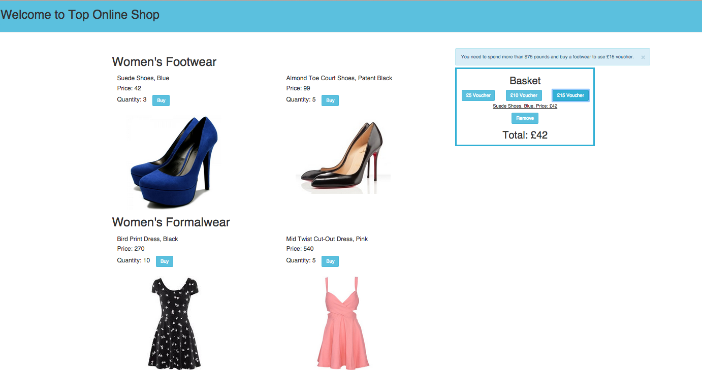

[](https://travis-ci.org/AnnaKL/Angular-Top-Online-Shop)

## Angular Top Online Shop



Clothing shop application built with:
* AngularJS with Flash module used for voucher error messages
* NodeJS Express as a server
* Styled with CSS and Bootstrap

Tested with:
* Karma for unit testing
* Protractor for UI testing

##User stories:

```
 As a User I can add a product to my shopping cart.
 As a User I can remove a product from my shopping cart.
 As a User I can view the total price for the products in my shopping cart.
 As a User I can apply a voucher to my shopping cart.
 As a User I can view the total price for the products in my shopping cart with discounts applied.
 As a User I am alerted when I apply an invalid voucher to my shopping cart.
 As a User I am unable to add Out of Stock products to the shopping cart.


 The discount vouchers used:
 - £5.00 off your order,
 - £10.00 off when you spend over £50.00,
 - £15.00 off when you have bought at least one footwear item and spent over £75.00
```

##Approach:

This is my second attempt on this challenge.

After initial feedback I tried to address all highlited issues on ionic application. Please see the repository here [Top Online Shop](https://github.com/AnnaKL/Top-Online-Shop).

However, I also decided to have another go and use pure AngularJS as I felt more comfortable with it.
Both of these applications contains similar logic, which follows MVC principles and had been refactored to get rid of repetition and make the code more readeable.

I built both of them by applying TDD principles with Karma unit testing and Protractor UI testing.

This project is a SPA(Single Page Application) optimized for desktop and styled with Bootstrap and CSS.
It displays all provided data in sections seperating Female and Male Wardrobe categories.
The basket appears only when used adds an item to an order and dissapears when all items are deleted.
All three vouchers are located in the basket and their requirements can be found in User Stories above. Vouchers can be applied only once. However, if user decides to remove any of the items from the basket any previously used discounts are cancelled and vouchers are active again. I've used Angular Flash module to create and show flash messages with information about requirements, if any of them is not met and user tried to apply the voucher.
I also used NodeJS Express as a server.

##File structure:

* Module is located in ```public/js/app.js```
* Controller is located in ```public/js/shopController.js```
* Factory is located in ```public/js/ShopFactory.js```
* HTML page can be found in ```public/index.html```
* Karma unit test code is located in ```tests/shopFactory.spec.js``` and ```tests/shopController.spec.js```
* Protractor UI test code is located in ```tests/e2e/onlineShopFeature.js```


##To run the app:

Please make sure that you have Node.js and Bower installed. Then:
```
git clone git@github.com:AnnaKL/Angular-Top-Online-Shop.git
cd Angular-Top-Online-Shop
bower install
npm install
npm start
Type localhost:4567 in your browser.
```

##To run the tests:

Make sure to have karma-cli, protractor and webdriver-manager installed.
```
npm install -g karma-cli
npm install -g protractor
webdriver-manager update
```

To run unit tests:
```
karma start tests/karma.conf
```

To run feature tests:
```
npm start
webdriver-manager start
protractor tests/e2e/conf.js
```